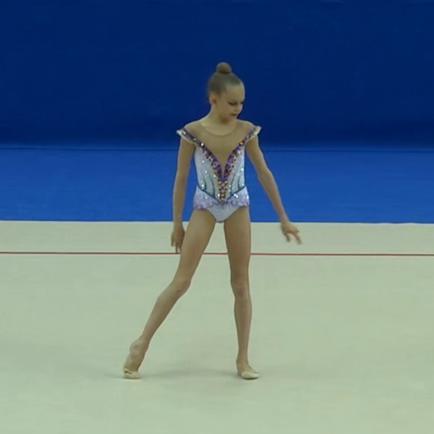
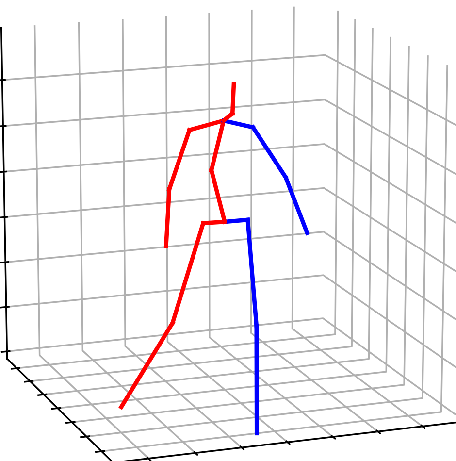

````markdown
# PoseGRAF: Geometric-Reinforced Adaptive Fusion for Monocular 3D Human Pose Estimation

<p align="center">
  
</p>


---

## 📌 Introduction
PoseGRAF is a novel framework that addresses key challenges in monocular 3D human-pose estimation:

- **Dual Graph Convolution** – simultaneously processes joint and bone graphs under geometric constraints.  
- **Geometry-Aware Fusion** – explicitly models the relationships between bone directions and joint angles.  
- **Dynamic Feature Integration** – adaptively fuses positional and geometric features via attention.  
- **Topology-Enhanced Transformer** – injects anatomical constraints directly into the transformer architecture.

PoseGRAF achieves state-of-the-art performance on standard benchmarks and generalises well to in-the-wild scenarios.

---

## 🚀 Key Results
| Metric | Dataset / Protocol | Result |
|--------|-------------------|--------|
| **MPJPE** | Human3.6M (CPN detections) | **48.1 mm** |
| **P-MPJPE** | Human3.6M | **38.3 mm** |
| **PCK** | MPI-INF-3DHP | **87.2 %** |

PoseGRAF is robust to occlusion and fast motion.

---

## 📦 Installation
```bash
# Clone the repository
git clone https://github.com/iCityLab/PoseGRAF.git
cd PoseGRAF

# Create the conda environment
conda env create -f environment.yml
````

---

## 📝 Acknowledgements

This codebase builds on the excellent work below—many thanks to the authors for open-sourcing their projects.

* [DGFormer](https://github.com/czmmmm/DGFormer)
* [PoseFormer](https://github.com/zczcwh/PoseFormer)
* [GraphMLP](https://github.com/Vegetebird/GraphMLP)
* [MeTDDI](https://github.com/LabWeng/MeTDDI)

---

## 🏋️‍♂️ Training from Scratch

Logs, checkpoints and auxiliary files will be written to `./checkpoint`.

#### Human3.6M

```bash
python main.py --train --model PoseGRAF --layers 6 --nepoch 40 --gpu 0
```

> *Note — our training script follows the convention of [VideoPose3D](https://github.com/facebookresearch/VideoPose3D). Please refer to their project page for further information. 


---

## 🎬 Pose-Estimation Comparison

<p align="center">
  
  
</p>

---

## 🌄 In-the-Wild Demo

### 1 · Install FFmpeg

Download the latest FFmpeg build from [https://ffmpeg.org/download.html](https://ffmpeg.org/download.html) and ensure the executable is on your `PATH`.

### 2 · Create the Side-by-Side Comparison Video

```bash
# ❶ Convert 2D key-point renders to a video
ffmpeg -framerate 30 -start_number 0 -i "%04d_2D.png" -vf "scale=-2:872,fps=100" -c:v libx264 -crf 23 -pix_fmt yuv420p pose2D.mp4

# ❷ Convert 3D key-point renders to a video
ffmpeg -framerate 30 -start_number 0 -i "%04d_3D.png" -vf "scale=-2:872,fps=100" -c:v libx264 -crf 23 -pix_fmt yuv420p pose3D.mp4

# ❸ Concatenate the two videos horizontally
ffmpeg -i pose2D.mp4 -i pose3D.mp4 -filter_complex "hstack=inputs=2" -c:v libx264 -crf 23 -pix_fmt yuv420p pose_comparison.mp4
```

<video src="videos/demo.mp4" controls width="600"></video>

---

## 🕺 Animated Dance GIF


```
```
